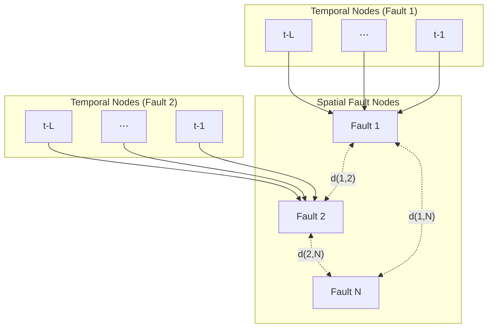

# CS224W_Project
Project work for CSS224W Course (Autumn 25)

# Earthquake Slip Prediction using Heterogeneous Graph Transformers

This project uses a heterogeneous graph neural network with multi-head attention and stacked spatio-temporal blocks to predict earthquake slip occurrences on repeating fault 

## Graph Architecture

The model uses a heterogeneous graph with two node types:


Diagram notes:
- `Fault 1`, `Fault 2`, `Fault N` example faults.  the graph includes all faults from the dataset
- `t-L ... t-1` are the L lookback months before prediction month `t`
- `d(i,j)` geographic distance in km between fault `i` and fault `j`. Attention uses this as a bias
### Node Types

1. **Spatial Nodes** (N nodes, one per fault):
   - **Feature**: Learnable embedding per fault (indexed by `fault_radius`)
   - **Connectivity**: Fully connected to all other spatial nodes from attention
   - **Purpose**: Represents the fault's identity/location

2. **Temporal Nodes** (L nodes per fault, one per time step):
   - **Features** (per time step):
     - `count`: Cumulative event count since dataset start
     - `max_mag`: Maximum magnitude observed since start
     - `months_ago`: Months since last event (default -999 if none)
   - **Connectivity**: Each temporal node connects only to its parent spatial node
   - **Purpose**: Encodes the fault's seismic history

### Message Passing

The two types of message passing:

1. **Temporal --> Spatial**: Each spatial node attends over its L temporal nodes to aggregate historical information:
   ```
   h_temporal = Attention(query=spatial_embedding, key/value=temporal_nodes)
   ```

2. **Spatial <--> Spatial**: All spatial nodes exchange information via distance-biased multi-head self-attention:
    ```
    Attention_score = (QK^T) / sqrt(head_dim) + β * distance_bias
    distance_bias = -dist(i,j) / τ  
    ```


### Prediction

After message passing, each spatial node's final embedding is passed through MLP heads to predict slip probability for 30, 90, and 180-days horizons

## Model Architecture


HeterogeneousSpatioTemporalTransformer
 * Spatial Embedding: nn.Embedding(num_nodes, hidden_dim)
 * Temporal Encoder: Linear --> LayerNorm --> GELU --> Linear
 * Temporal Position Encoding: nn.Embedding(100, hidden_dim)
 * Stacked Blocks (num_layers):
   * Block 1: Temporal-->Spatial (multi-head, fused KV), Spatial Self-Attention (multi-head, fused QKV), FFN + residual
   * Blocks 2...L: Spatial Self-Attention (multi-head), FFN + residual
 * Final LayerNorm
 * Prediction Heads: Linear --> GELU --> Dropout --> Linear (one per horizon)


## Files

- `src/model_spatiotemporal.py`: Heterogeneous graph transformer model
- `src/train_spatiotemporal.py`: Training script with early stopping
- `src/data_utils.py`: Data loading and preprocessing
- `src/config.py`: Configuration (lookback, horizons, etc.)
- `src/model.py`: GraphSAGE baseline model
- `src/model_transformer.py`: Graph Transformer with PEARL positional encodings

## Training

```bash
python src/train_spatiotemporal.py --epochs 100 --batch_size 16 --hidden_dim 16 --num_layers 2 --num_heads 4 --dropout 0.5
```

